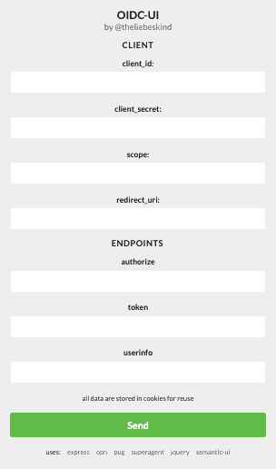

# oidc-ui

A simple OIDC UI.

## Setup

###  Directly

- Install dependencies: `npm i`
- Start service 
  - on default port 8080: `npm start`
  - or custom port: `PORT=1234 npm start`

### Docker
- Build docker container via Dockerfile,
- Start docker as usual,
- optionally setting a custom port via the PORT env var

Or simply use the docker image available at https://hub.docker.io: `docker pull theliebeskind/oidc-ui`

## Usage

- Enter client credentials in section "client"
- Enter your name/ip and port of this service and the endpoint "oidc" in "redirect_uri", e.g. http://localhost:8080/oidc
  - _notice_: this service url has to be whitelisted for the specified client id
- Enter OIDC endpoints in section "endpoints" (userinfo endpoint is optional and is not used yet)
- Hit "send"
  - All inputs are stored in a cookie and will be available when visiting the page the next time
- Copy access or refresh tokens on the final page
- Optionally refresh access tokens from the refresh tokens
